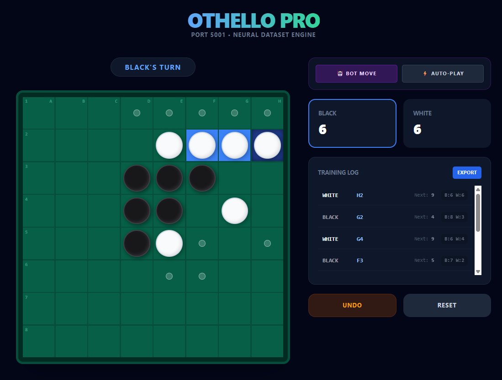

## Othello Pro — Neural Dataset Engine

Lightweight Flask web engine and terminal runner for generating ML-ready Othello (Reversi) gameplay data.



This repository contains:

- `main.py` — Flask web server and frontend integration. Exposes API endpoints used by the browser UI and manages per-session game instances.
- `othello.py` — Core `OthelloGame` class: game rules, validation, history snapshots, CSV export, and a small rich terminal renderer.
- `othello_terminal.py` — Terminal autoplay runner that plays a full game and writes a CSV export.
- `templates/index.html` — Tailwind-based frontend that interacts with the Flask API and renders the 8x8 board.

Key design points:

- Each move is recorded with a rich snapshot (board state, positional features, pre/post scores, mobility, etc.) suitable for ML training.
- Web sessions are tracked in a server-side `GAMES` dict keyed by `session['user_id']` (see `main.py`).
- On game end, the engine auto-exports CSV history into the configured `GAME_EXPORT_DIR`.

---

## Quickstart — Web

1. Create and activate a Python environment and install dependencies (the project uses `uv` for package management; `flask`, `pandas`, and `python-dotenv` are required).

2. Optionally create a `.env` file to override defaults (see Environment Variables below).

3. Run the web server:

```bash
python main.py
```

Open http://127.0.0.1:5001/ to load the frontend.

Important API endpoints (used by the frontend):

- `GET /` — Serves `templates/index.html`.
- `POST /move` — Apply a move. Sending `{ row: -1, col: -1 }` returns current state without changing the board.
- `POST /bot-move` — Engine plays a single automated move.
- `POST /undo` — Undo last move.
- `POST /reset` — Reset board to initial position.
- `GET /export` — Stream CSV export of current game history.

---

## Quickstart — Terminal Autoplay

Run the terminal runner to auto-play a game and export its history:

```bash
python othello_terminal.py
```

This writes a CSV into the configured export directory when the game finishes.

---

## Environment Variables

Set these in a `.env` file to customize behavior (defaults shown):

- `GAME_EXPORT_DIR` — `game_exports/` (where CSVs are saved)
- `WEB_EXPORT_PREFIX` — `othello_web_game_`
- `TERMINAL_EXPORT_PREFIX` — `othello_terminal_data_`
- `FLASK_PORT` — `5001`
- `FLASK_DEBUG` — `True` or `False`

---

## Exports & Dataset

- `OthelloGame.history` is a list of rich move records. Use `/export` or `OthelloGame.export_csv()` to create CSVs suitable for ML ingestion.
- Default export location: `game_exports/` with configured filename prefixes.

---

## Development / Quality

Follow repository conventions before committing changes:

- Install dependencies with your environment tool (`uv sync` as per project conventions).
- Lint: `ruff check .`
- Format: `black --check .` (use `black .` to fix)
- Type-check: `mypy .`
- Tests: `pytest`

---

## Files of interest

- [main.py](main.py)
- [othello.py](othello.py)
- [othello_terminal.py](othello_terminal.py)
- [templates/index.html](templates/index.html)

---

If you want, I can add a CONTRIBUTING section, create a `requirements.txt`, or run the project checks and tests.

License: see `LICENSE` in the repo root.
# Othello Pro: Neural Dataset Engine

⚠️ **PROJECT STATUS: UNDER CONSTRUCTION**

**Othello Pro** is a high-fidelity, web-based implementation of the classic strategy game Othello (Reversi). This project is designed as a **Neural-Ready Dataset Engine**, enabling developers to generate high-quality datasets for training reinforcement learning or supervised learning models through real-time gameplay interaction.

---

## 🚀 Key Features

* **Neural-Ready Logging:** Every move captures a full 8x8 snapshot of the board *before* the piece is placed, alongside move coordinates, intermediate scores, and opponent move counts.
* **Tactile 3D UI:** A sophisticated front-end using Tailwind CSS and custom CSS shadows to create realistic gaming textures and tactile 3D pieces.
* **Intelligent Game Engine:** Pure Python backend implementation of Othello rules, including directional scanning, move validation, and turn-skipping logic.
* **Visual Move Indicators:** "Ghost dots" and color-coded highlighting guide players by showing valid moves. The UI emphasizes the last piece placed (Dark Blue) and its resulting flips (Light Blue).
* **Advanced Controls:** Includes multi-step **Undo** functionality, hot-seat local multiplayer, and a one-click **JSON Dataset Export**.
* **Integrated Coordinates:** Strategic board decoration with row numbers (1-8) and column letters (A-H) for easy algebraic notation.

---

## 🛠️ Technical Architecture

The application follows a modular structure that decouples game logic from the presentation layer:

| Component | Technology | Responsibility |
| :--- | :--- | :--- |
| **Backend** | Python / Flask | Core game logic, state management, and 0-indexed coordinate system. |
| **Frontend** | HTML5 / JS / Tailwind | Responsive 8x8 grid, 3D piece rendering, and interactive move logging. |
| **Dataset Engine** | JSON / Blob | Snapshotting board states and metadata for machine learning training logs. |

---

## 📖 How to Play

* **Objective:** Have the majority of your color discs on the board at the end of the game.
* **Placement:** A move must "out-flank" one or more of the opponent's discs in any of the 8 directions (horizontal, vertical, or diagonal).
* **Capturing:** All opponent pieces caught in a straight line between the newly placed piece and an existing piece of your color are flipped.
* **Turns:** If a player has no valid moves, their turn is skipped. If neither player can move, the game terminates and a winner is declared based on final scores.

---

## 📦 Installation & Setup

This project uses `uv` for fast and reliable Python package management.

1.  **Clone the repository:**
    ```bash
    git clone https://github.com/wraaaaa/othello_neural_dataset_engine.git
    cd othello_neural_dataset_engine
    ```

2.  **Initialize and Install dependencies:**
    ```bash
    uv init
    uv add flask
    ```

3.  **Run the engine:**
    ```bash
    uv run main.py
    ```

4.  **Access the UI:** Open [http://127.0.0.1:5001](http://127.0.0.1:5001) in your browser.

---

## 🧪 Dataset Format

Exported datasets provide a JSON array of move objects, structured for immediate ingestion into training pipelines. Each entry represents a single state-action pair:

```json
{
  "player": "BLACK",
  "row": 3,
  "col": 2,
  "timestamp": 1734912000,
  "boardBefore": [
    ["NONE", "NONE", "NONE", "NONE", "NONE", "NONE", "NONE", "NONE"],
    ["NONE", "NONE", "NONE", "NONE", "NONE", "NONE", "NONE", "NONE"],
    ["NONE", "NONE", "NONE", "NONE", "NONE", "NONE", "NONE", "NONE"],
    ["NONE", "NONE", "NONE", "WHITE", "BLACK", "NONE", "NONE", "NONE"],
    ["NONE", "NONE", "NONE", "BLACK", "WHITE", "NONE", "NONE", "NONE"],
    ["NONE", "NONE", "NONE", "NONE", "NONE", "NONE", "NONE", "NONE"],
    ["NONE", "NONE", "NONE", "NONE", "NONE", "NONE", "NONE", "NONE"],
    ["NONE", "NONE", "NONE", "NONE", "NONE", "NONE", "NONE", "NONE"]
  ],
  "scoreAfter": { "black": 4, "white": 1 },
  "nextMovesCount": 3
}
```

---

## 🛠️ API Reference

The backend exposes the following endpoints to manage the game state and facilitate data extraction:

| Endpoint    | Method | Description |
|-------------|--------|-------------|
| `/`         | GET    | Serves the main Othello Pro Dashboard interface. |
| `/move`     | POST   | Validates and applies a move; returns updated board, last move, and flipped piece highlights. |
| `/undo`     | POST   | Reverts the engine and UI to the previous state using the move history stack. |
| `/reset`    | POST   | Wipes the current session history and re-initializes the board to the starting position. |
